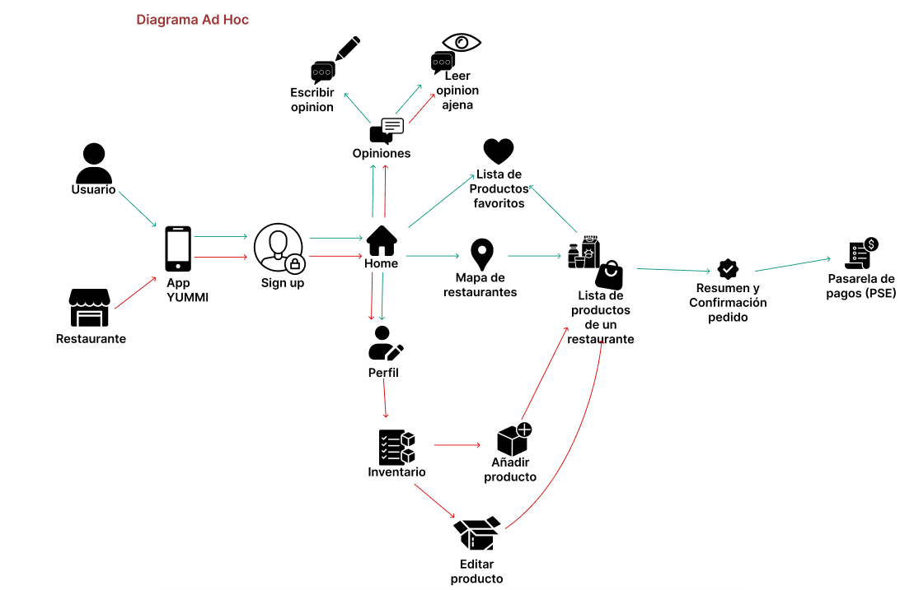
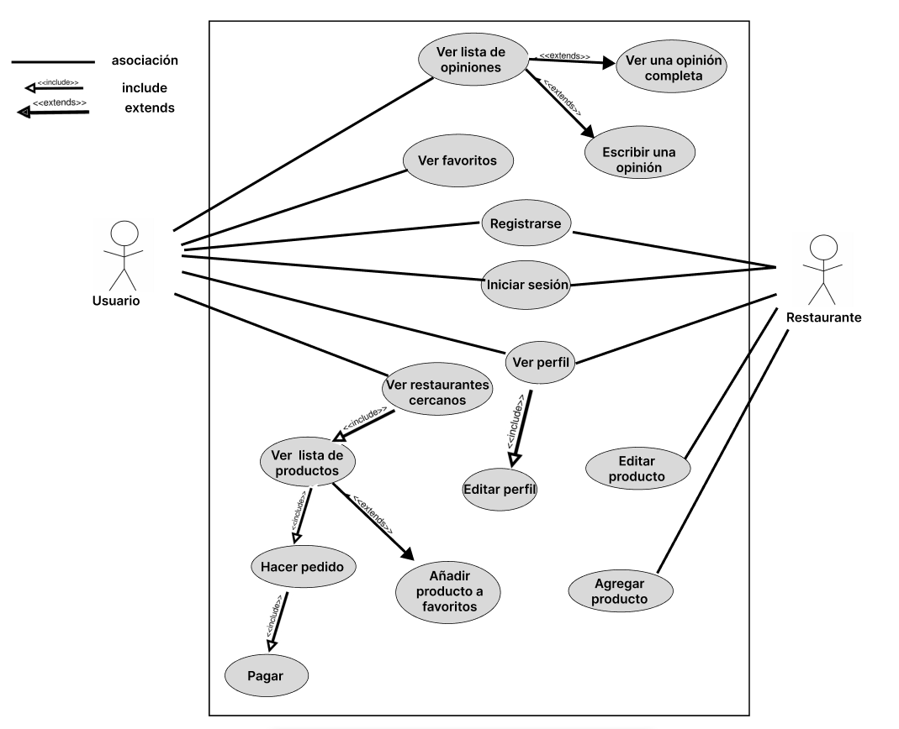

<h2>DIAGRAMA AD HOC<H2>

<H2>CASOS DE USO<H2>

<H2>DIAGRAMA DE SECUENCIA<H2>
<H3>USUARIO HACER PEDIDO Y PAGAR<H3>

<H3>USUARIO VER FAV Y OPINIONES<H3>

<H3>RESTAURANTES GESTIONAR PRODUCTOS<H3>

<H3>VER PERFIL/ EDITAR PERFIL<H3>

<H2>DIAGRAMA MODELO RELACIONAL<H2>

<H2>DIAGRAMA DE COMPONENTES<h2>

