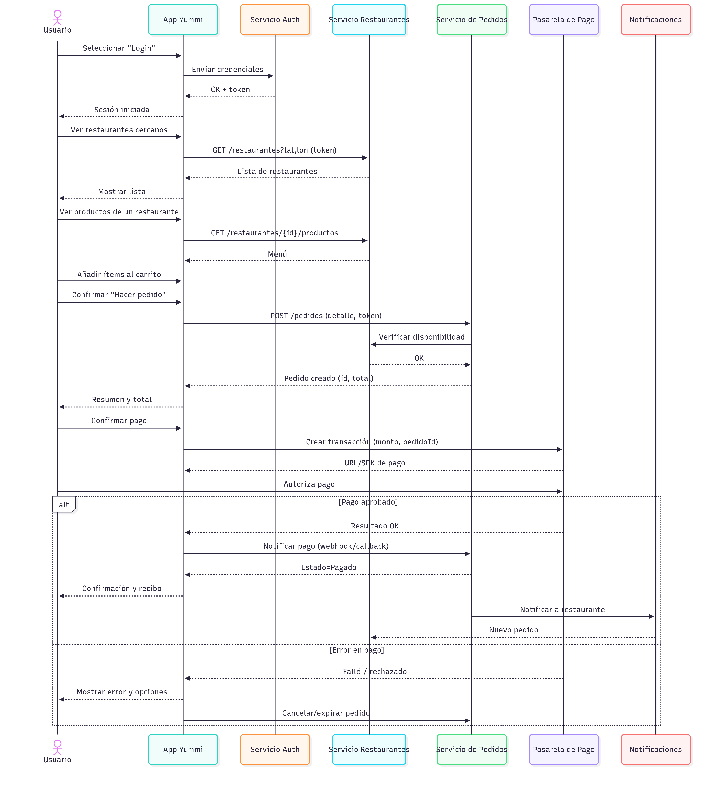
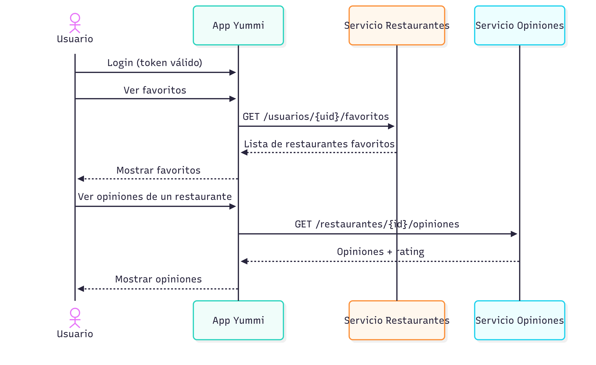
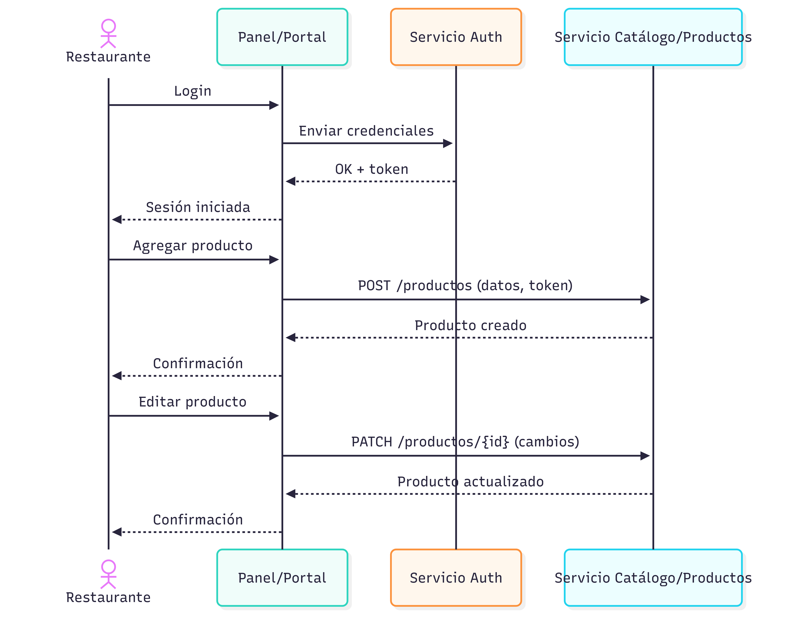
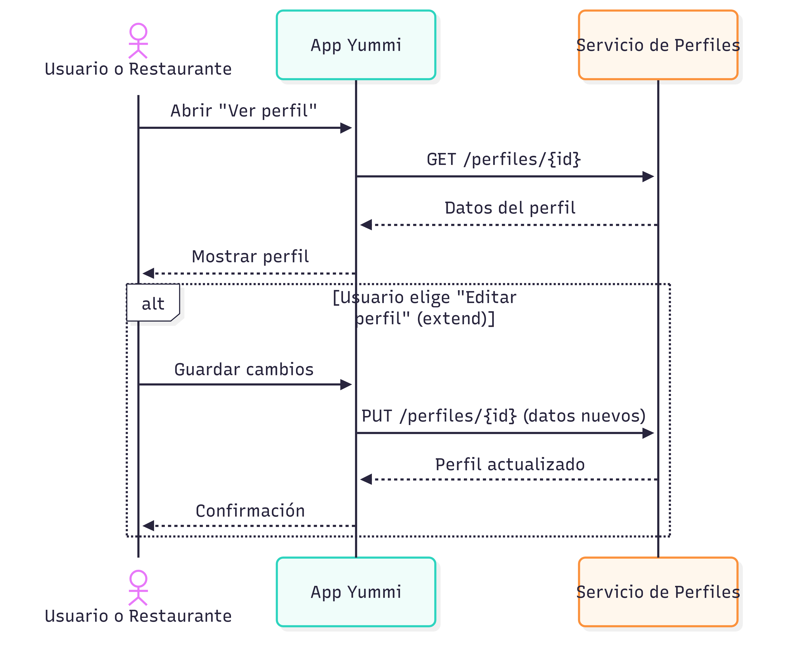
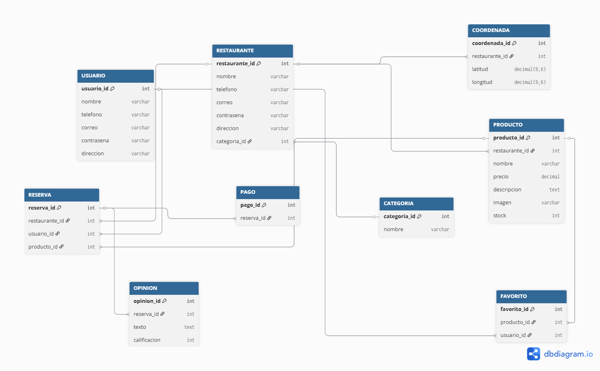
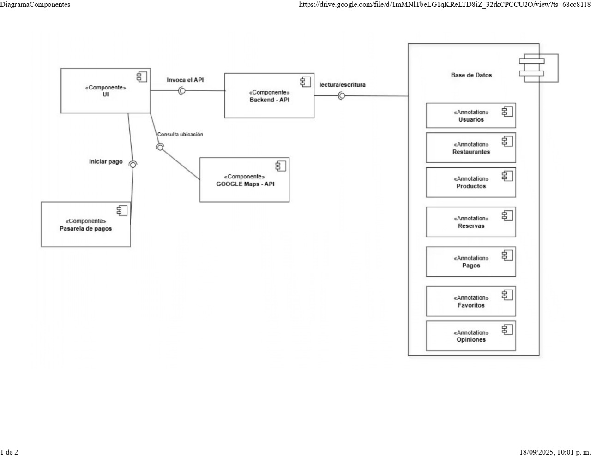

# 📌 DIAGRAMAS DEL PROYECTO

---

## 📊 DIAGRAMA AD HOC  

---

## ⚙️ CASOS DE USO  

---

## 🔄 DIAGRAMA DE SECUENCIA  

### 👤 Usuario: Hacer pedido y pagar  

### 👤 Usuario: Ver favoritos y opiniones  

### 🍽️ Restaurantes: Gestionar productos  

### 👤 Usuario: Ver perfil / Editar perfil  

---

## 🗄️ DIAGRAMA MODELO RELACIONAL  

---

## 🧩 DIAGRAMA DE COMPONENTES  

