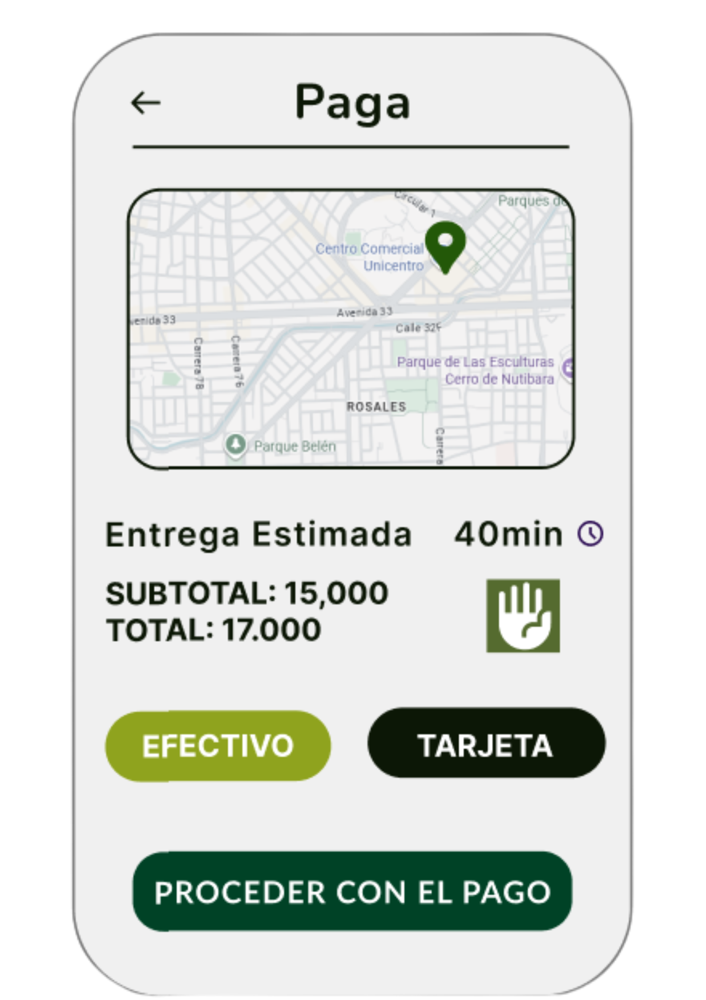
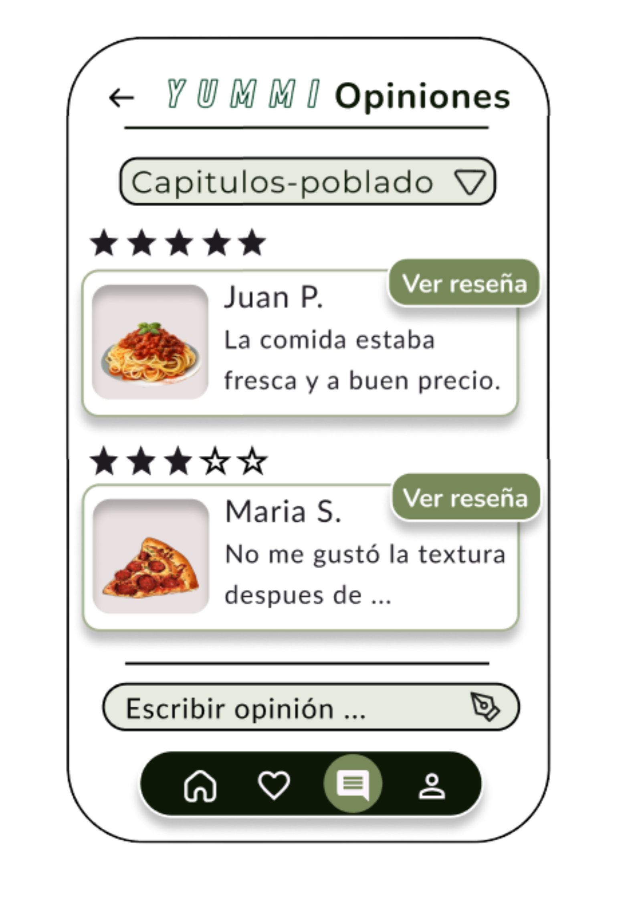
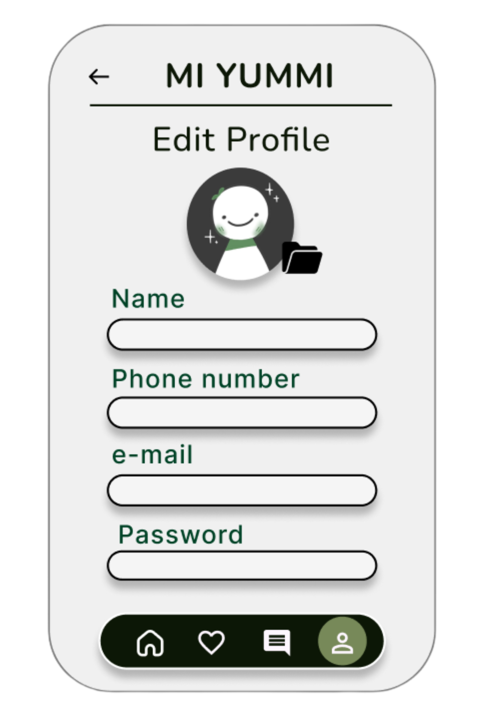
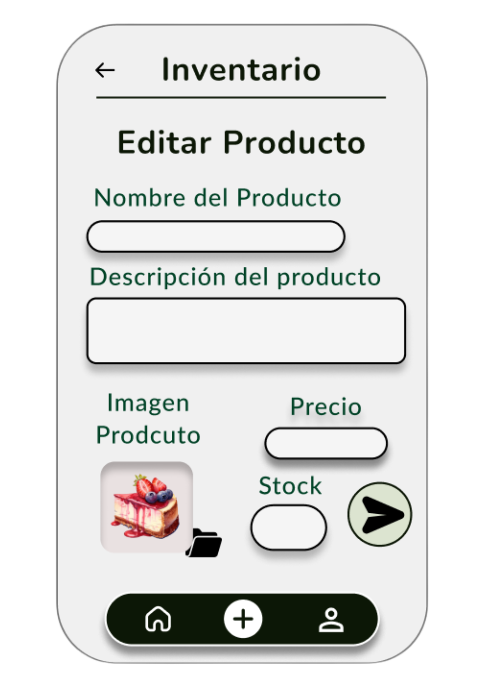

# UI de la Aplicación

🔗 **Link del UI en Figma:** [Ver en Figma](https://www.figma.com/design/rkjK4lrQw7bTkptefCKaOY/Sin-t%C3%ADtulo?t=Rn968EbAHveqSy51-1)

---

## 🖼️ Pantallas

### 🚀 Splash Screen

---

### 🔑 Login

---

### 📝 Registro (Signup)

---

### 🏠 Home

---

### 🗺️ Mapa

---

### 🛍️ Lista de Productos

---

### 📦 Orden

---

### 💳 Pago

---

### ⭐ Favoritos

---

### 💬 Reseñas

---
### 💬 Escribir una Reseña

---
### 💬 Leer Reseñas

---

### 👤 Perfil de Usuario

---

### 👤 Editar Perfil de Usuario

---

### 🏢 Perfil de Empresa

---

### ✏️ Editar Producto

---

### ➕ Agregar Producto

