# Wireframes de la Aplicación

🔗 **Link del wireframe en Figma:** [Ver en Figma](https://www.figma.com/design/ZLbLMpXCmNcv9iUVEP54ik/Wireframe?node-id=0-1&t=LT4A1PuNcu1tMTCT-1)

---

## 🖼️ Pantallas

### 🚀 Splash Screen

---

### 🔑 Login
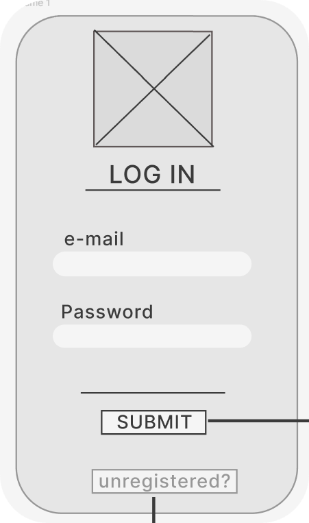

---

### 📝 Registro (Signup)
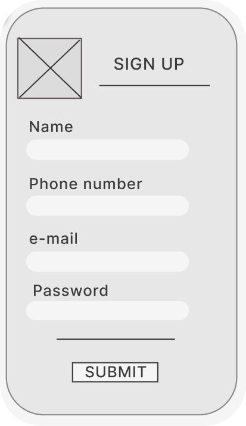

---

### 🏠 Home
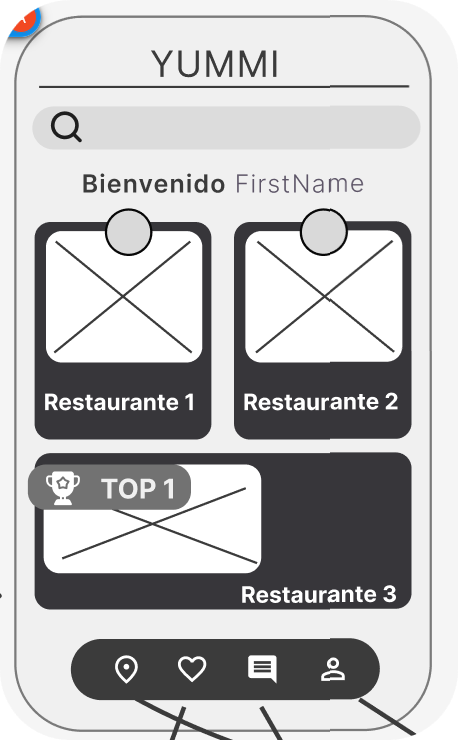

---

### 🗺️ Mapa
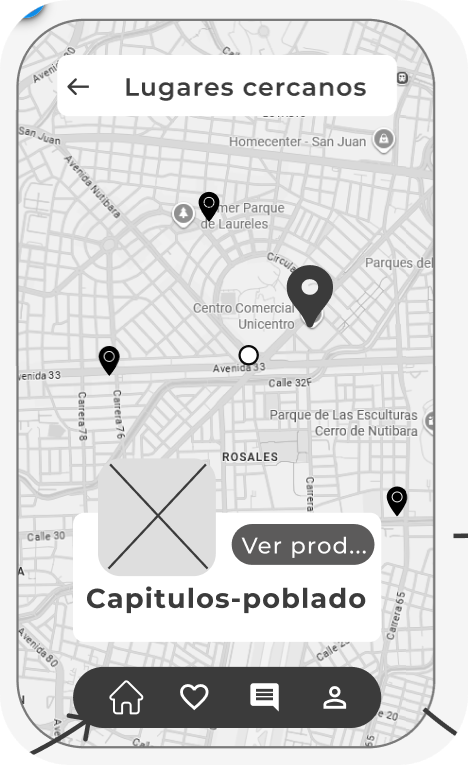

---

### 🛍️ Lista de Productos
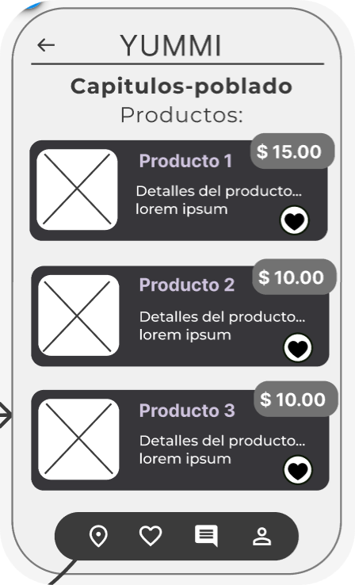

---

### 📦 Orden

---

### 💳 Pago

---

### ⭐ Favoritos
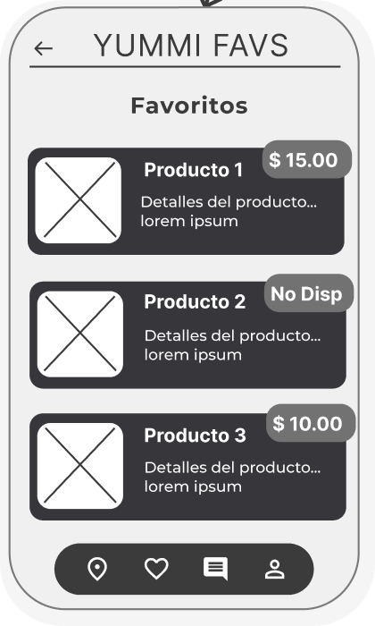

---

### 💬 Reseñas

---
### 💬 Escribir una Reseña
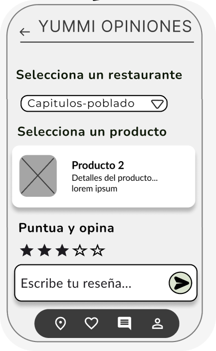

---
### 💬 Leer Reseñas
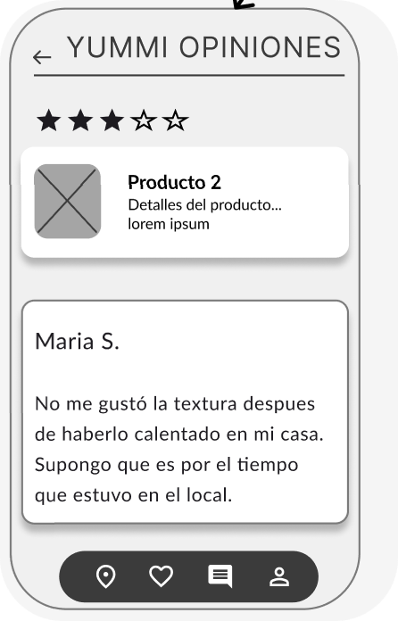

---

### 👤 Perfil de Usuario
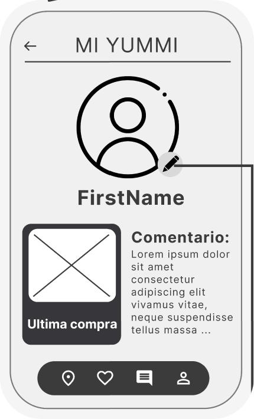

---

### 👤 Editar Perfil de Usuario
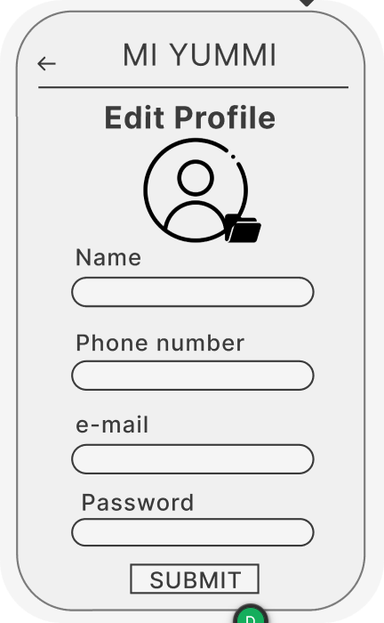

---

### 🏢 Perfil de Empresa
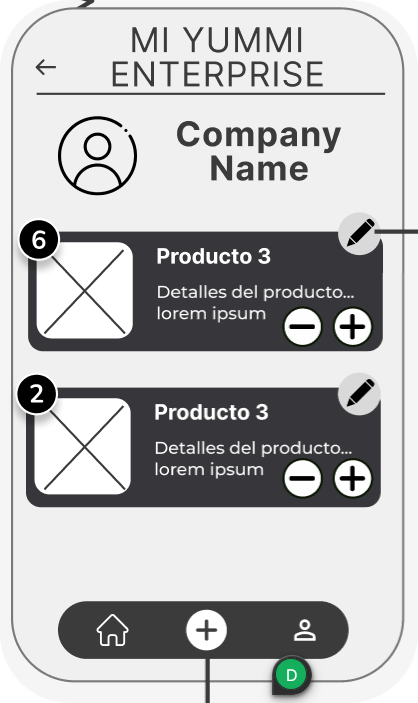

---

### ✏️ Editar Producto
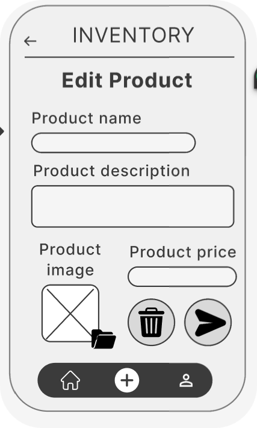

---

### ➕ Agregar Producto
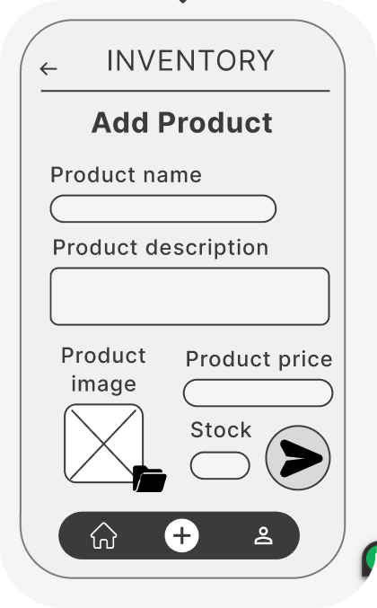
