# Wireframes de la Aplicación

🔗 **Link del wireframe en Figma:** [Ver en Figma](https://www.figma.com/design/ZLbLMpXCmNcv9iUVEP54ik/Wireframe?node-id=0-1&t=LT4A1PuNcu1tMTCT-1)

---

# 🖼️ Pantallas

### ⏭ Splash Screen

### 🔑 Inicio de sesión
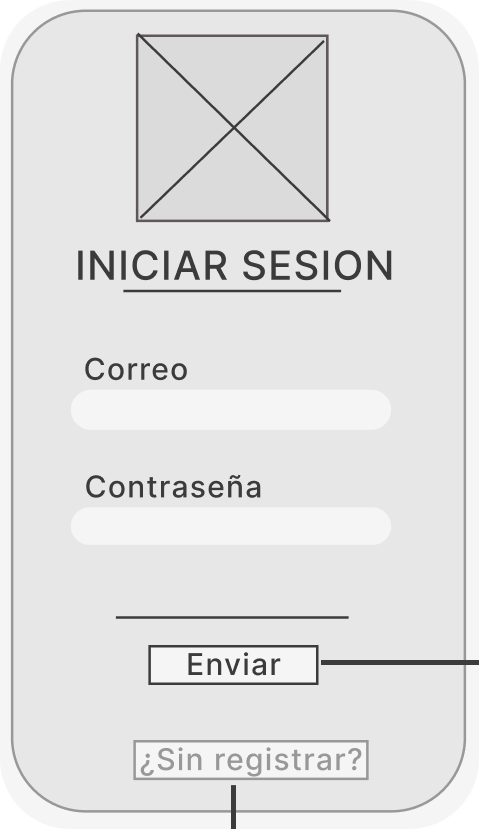

### 📝 Registro 
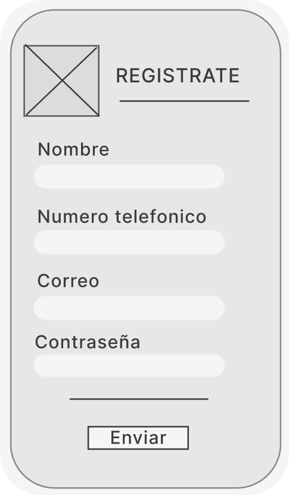

### 🏠 Pantalla de inicio o Home
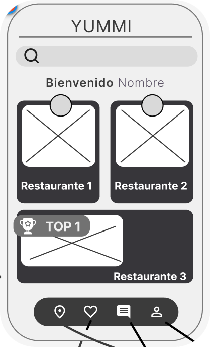

### 🗺️ Mapa
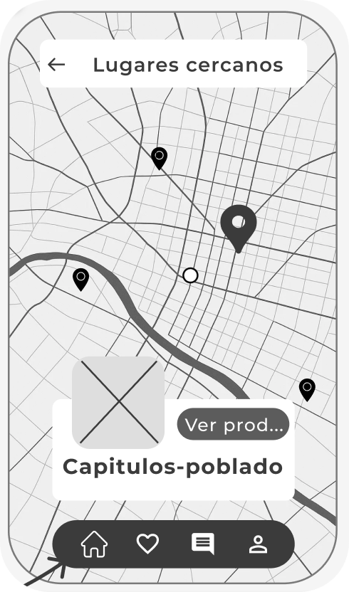

### 🛍️ Lista de Productos
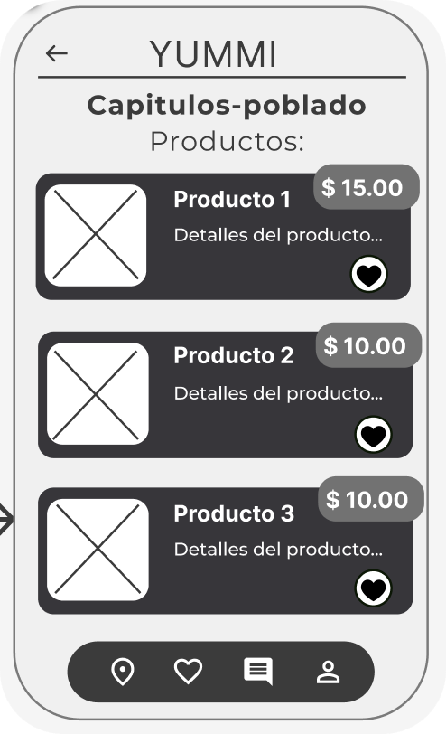

### 📦 Orden
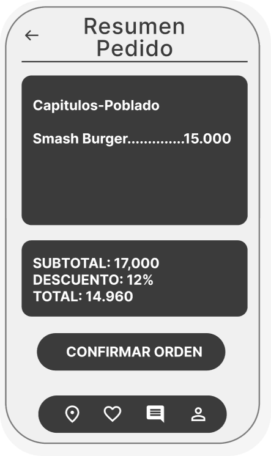

### 💳 Pago

### ⭐ Favoritos
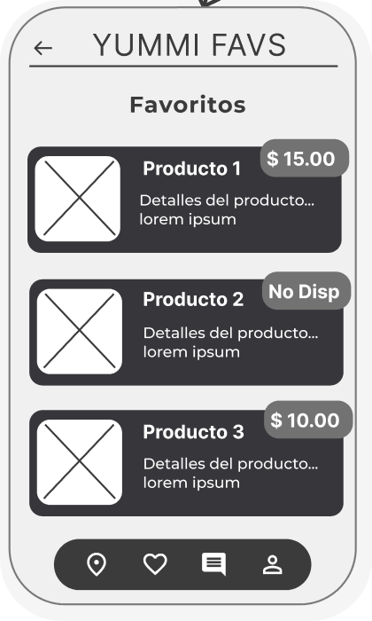

### 💬 Opiniones
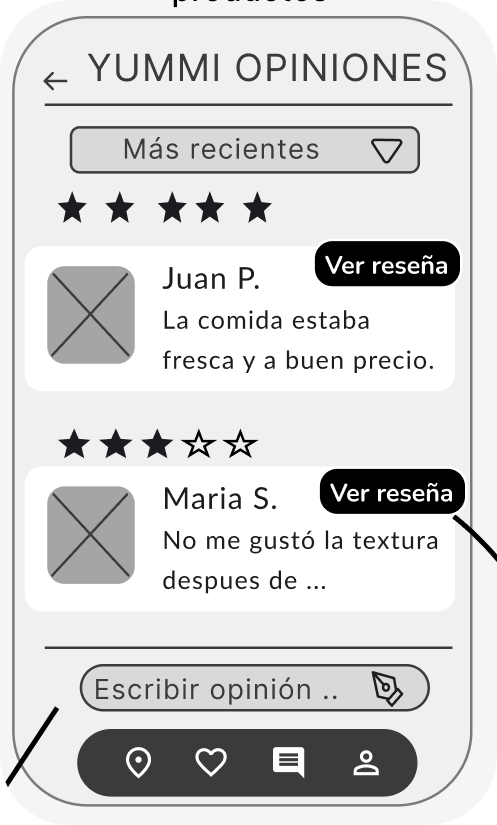

### 💬 Escribir una Opinión
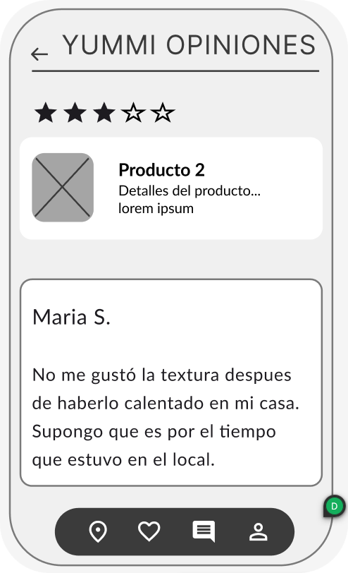

### 💬 Leer Opinión
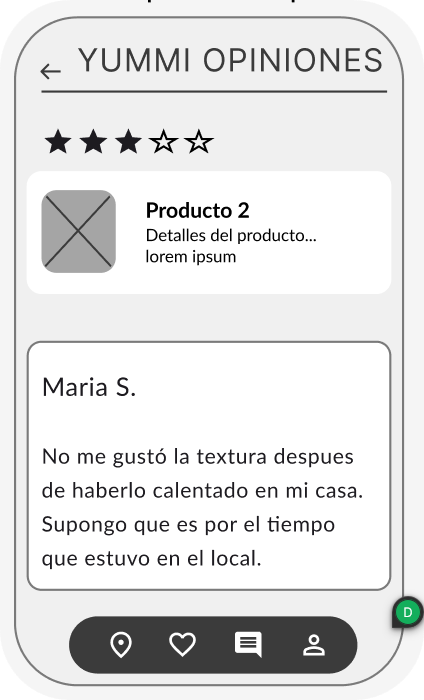

### 👤 Perfil de Usuario
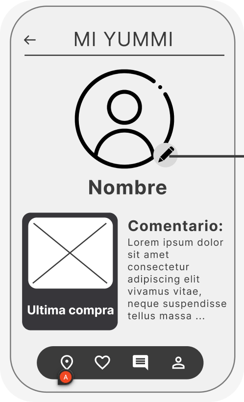

### 🏢 Perfil de Empresa
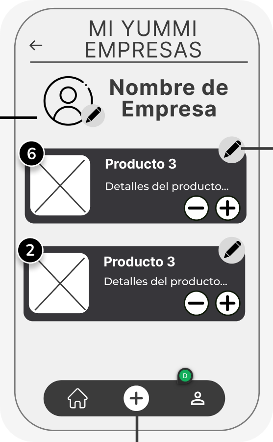

### 👤 Editar Perfil
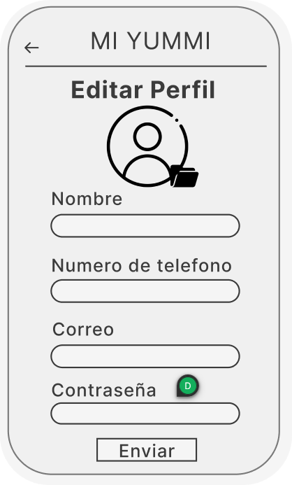

### ➕ Agregar Producto
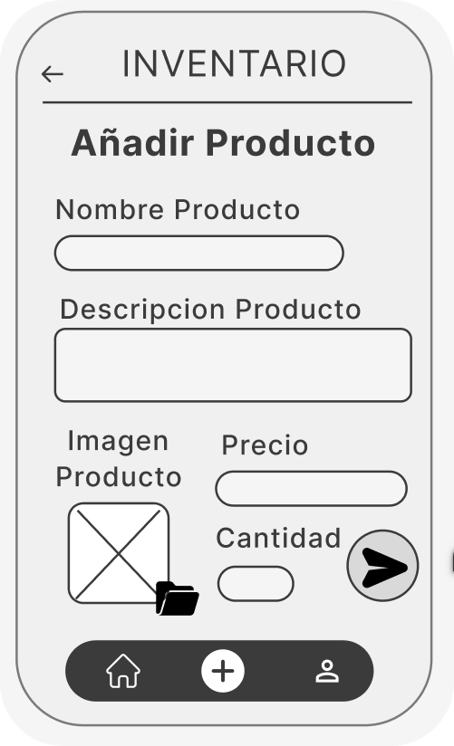

### ✏️ Editar Producto
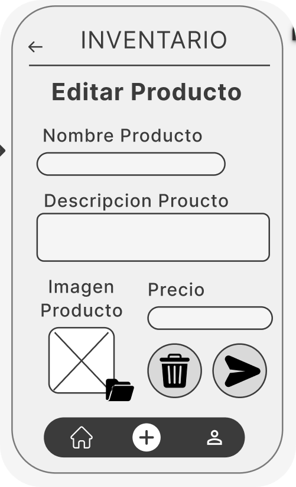

